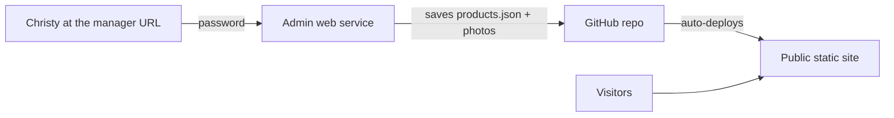

# Christy's Cozy Critters Website

A warm, cozy static website for **Christy's Cozy Critters** — hand-knit stuffed animals,
mini critters, Christmas stockings, chunky flowers, and custom orders made with love in
North Carolina.

Visitors can browse the full catalog with prices, filter by category, and place an order
by sending an inquiry (contact form or Instagram DM). There is no online checkout —
pricing and payment are arranged directly with Christy, matching how she works today.

## How it's built (two parts)

This project has two pieces, both hosted on **Render**:

1. **The public website** — plain HTML/CSS/JS, served as a fast, free **Render Static
   Site**. This is what visitors see.
2. **The shop manager** — a small **Render Web Service** (Node) that shows Christy a
   password box and lets her add/edit critters. When she saves, it writes the changes back
   into this GitHub repo, which makes the static site rebuild and go live.



## What's in here

```
index.html                 Home page (hero, categories, featured, ordering teaser)
shop.html                  Shop — full catalog with category filters
about.html                 About Christy
how-to-order.html          Step-by-step ordering info
contact.html               Contact / order inquiry form (Formspree)
products.json              The product catalog (managed via the shop manager)
render.yaml                Render Blueprint — sets up both services at once
admin/index.html           Small redirect page: sends "Manage site" to the manager
assets/
  css/styles.css           Cozy theme + responsive layout
  js/main.js               Renders products, filters, inquiry flow, contact form
  images/                  Logo + placeholder product art
  images/uploads/          Photos Christy uploads through the shop manager
server/                    The shop manager web service (Node/Express)
  server.js                Login, product save, photo upload, image preview
  github.js                Reads/writes files in the GitHub repo
  public/                  The manager's login screen + editor UI
```

The public site is separate HTML pages that share one nav, stylesheet, and script.
When a visitor clicks **Order / Inquire** on a product, they're sent to `contact.html`
with that product prefilled (via a `?product=` link). The category cards on the home page
link into `shop.html?category=...` to open a filtered view.

## Viewing the site locally

Because the shop loads `products.json` with `fetch`, open the site through a small local
server (not by double-clicking the file):

```bash
# from this folder, using Python 3
python3 -m http.server 8000
# then open http://localhost:8000
```

Any static server works (VS Code "Live Server", `npx serve`, etc.).

## Managing products (for Christy)

Once everything is set up (see "One-time setup" below), Christy adds, edits, and removes
critters herself — no code, no help needed:

1. Go to the **shop manager address** (the `.onrender.com` link for the admin service).
   There's also a small **Manage site** link in the footer of every page once it's wired up.
2. Type the **password** and click **Sign In**.
3. Click **+ Add Critter**. Enter the name, pick a category, set the price (or leave it
   blank to show **"Ask"**), write a description, **upload a photo**, choose Available or
   Sold, and optionally tick **Feature on home page**. Click **Done**.
4. Click **Save & Update Site**. Within about a minute the website updates for everyone.

To edit or remove a critter, use the **Edit** / **Delete** buttons in the list, then
**Save & Update Site** again.

### Advanced: editing products by hand

The admin panel simply edits `products.json`. Developers can edit that file directly if
they prefer. Each item looks like this:

```json
{
  "id": "elephant-plush",
  "name": "Cuddle Elephant",
  "category": "animals",
  "price": 35,
  "description": "Super-soft chunky knit elephant with floppy ears.",
  "image": "assets/images/uploads/elephant.jpg",
  "status": "available",
  "featured": true
}
```

Field notes:
- `category` must match one of the `id`s in the `categories` list at the top of the file
  (`animals`, `minis`, `stockings`, `flowers`, `custom`).
- `price` can be a number (e.g. `35`) or `null`/blank to show **"Ask"**.
- `status` is `"available"` or `"sold"` (sold items show a "Sold" badge and disabled button).
- `featured: true` shows the item in the home-page "A Few Favorites" section.
- `image` is a path to a photo (uploads land in `assets/images/uploads/`).

To replace the logo, swap `assets/images/logo.svg` (keep the filename, or update the
references in the HTML). Roughly square product photos look best (cards are square-cropped).

## One-time setup (on Render)

Done once by you. After this, Christy manages everything with just her password.

### 1. Put the code on GitHub
Create a free [GitHub](https://github.com/) account and push this folder to a new
repository (default branch `main`). The shop manager saves changes here, and Render
deploys from here.

### 2. Make a GitHub token (lets the manager save changes)
1. GitHub → **Settings → Developer settings → Personal access tokens → Fine-grained
   tokens → Generate new token**.
2. **Repository access:** Only select repositories → pick this repo.
3. **Permissions:** under Repository permissions, set **Contents: Read and write**.
4. Generate it and copy the token (starts with `github_pat_...`). You'll paste it into
   Render in step 4. Keep it secret.

### 3. Create both Render services from the Blueprint
1. In [Render](https://render.com/): **New + → Blueprint**, and pick this GitHub repo.
   Render reads `render.yaml` and proposes two services:
   - `christys-cozy-critters` — the public website (static)
   - `christys-cozy-critters-admin` — the shop manager (web service)
2. Approve/apply the Blueprint.

(You can also create them manually: a **Static Site** with publish path `.`, and a **Web
Service** with root directory `server`, build `npm install`, start `npm start`.)

### 4. Fill in the manager's settings (environment variables)
On the **admin** service in Render → **Environment**, set:
- `ADMIN_PASSWORD` — the password you give Christy.
- `GITHUB_TOKEN` — the token from step 2.
- `GITHUB_OWNER` — your GitHub username (or org).
- `GITHUB_REPO` — the repository name.
- `GITHUB_BRANCH` — `main` (already set).
- `SESSION_SECRET` — Render fills this in automatically.

Save; Render redeploys the manager.

### 5. Link the "Manage site" button
Copy the admin service address (ends in `.onrender.com`) and paste it into `ADMIN_URL`
near the top of [admin/index.html](admin/index.html). Commit/push. Now the footer
**Manage site** link (and `/admin`) opens the manager.

### 6. Give Christy her password
Send her the manager address and the `ADMIN_PASSWORD`. She signs in and starts adding
critters. That's the whole ongoing workflow — nothing else for you to do.

> Tip: Render's free web service "sleeps" after inactivity, so the **first** time Christy
> opens the manager it may take ~30-60 seconds to wake up. The public website is a static
> site, so visitors are never affected by this.

## Contact form (Formspree)

The contact form posts to [Formspree](https://formspree.io/) (free tier), which emails
Christy each submission — works on any host.

1. Create a free Formspree account and a new form; copy its endpoint
   (looks like `https://formspree.io/f/abcdwxyz`).
2. In [contact.html](contact.html), replace `https://formspree.io/f/YOUR_FORM_ID` in the
   form's `action` with your endpoint.
3. Set the form's notification email to Christy's address in Formspree.

Until that's set, the form gracefully shows a "DM me on Instagram" message instead.

## Running the manager locally (optional, for developers)

```bash
cd server
npm install
ADMIN_PASSWORD=test SESSION_SECRET=dev \
GITHUB_OWNER=you GITHUB_REPO=your-repo GITHUB_TOKEN=your_token \
npm start
# then open http://localhost:3000
```

The public pages preview without any of this — just serve the project root with any static
server (e.g. `python3 -m http.server 8000`).

## Customizing

- **Colors / fonts:** edit the variables at the top of `assets/css/styles.css` (`:root`).
- **Text / sections:** edit `index.html` directly.
- **Instagram link:** used in `index.html` and once in `assets/js/main.js` (`IG_URL`).
# Christys-Cozy-Critters
